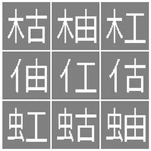
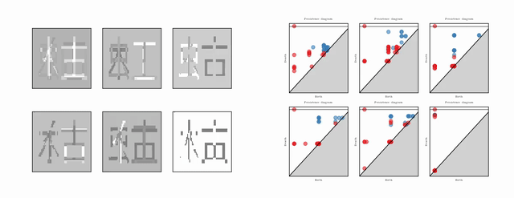

# TopNMF

TopNMF is a Python library for non-negative matrix factorisation (NMF) with topological regularisation. It combines standard reconstruction losses with persistent homology penalties so learned basis vectors can favour sparse, periodic, image-like, or graph-structured components.

This is companion code for the paper "Non-negative Matrix Factorisation with Topological Regularisation" [arXiv:2606.17531](https://arxiv.org/abs/2606.17531).

```bibtex
@article{topnmf2026,
  title={Non-negative Matrix Factorisation with Topological Regularisation},
  author={de Jong van Lier, Matias and Kaji, Shizuo and Kim, Keunsu},
  journal={arXiv preprint arXiv:2606.17531},
  year={2026}
}
```

The animation below shows TopNMF learning 6 NMF basis images from 9 data samples using cubical-complex topological regularisation.




## What TopNMF Supports

- 1-D signals with optional time-delay embedding and Vietoris-Rips persistence
- 2-D grid or image data via cubical complexes
- Edge-weighted graphs via simplex-tree filtrations
- PyTorch-based optimisation with explicit non-negativity constraints on both factors

## Installation

TopNMF targets Python 3.9 or newer.

```bash
pip install -e .
```

For tests and development tools:

```bash
pip install -e ".[dev]"
```

For Wasserstein reconstruction loss support, install the optional `pot` and `geomloss` packages:

```bash
pip install -e ".[wasserstein]"
```

For running the example notebooks (adds `pandas`, `scikit-image`, `wfdb`, and the
baselines used for comparison):

```bash
pip install -e ".[notebook]"
```

The package installs the persistent-homology backends `gudhi` and `cripser`.

## Quick Start

The topological term of the objective is `lambda_top * (diagram loss + periodicity
loss)`. The diagram loss is the `ph_loss_fn` passed to the constructor, and the
periodicity loss comes from the `target_periodicity` argument of `fit()`. Both are
opt-in: with neither of them set, `fit()` performs plain NMF regardless of
`lambda_top`.

### Time-Series Decomposition

```python
import numpy as np
from TopNMF import TopologicalNMF, generate_signals, ph_sparsity_loss

t = np.linspace(0.0, 4.0 * np.pi, 200)
X = np.vstack(generate_signals(t, kind="cosine", num=4))

model = TopologicalNMF(
    n_components=2,
    use_embedding=True,
    ph_loss_fn=ph_sparsity_loss,
)
model.fit(
    X,
    n_iterations=300,
    lambda_top=1e-2,
    embedding_dim=4,
    verbose=False,
)

components = model.get_components()
coefficients = model.transform(X)
reconstruction = model.inverse_transform()
losses = model.get_losses()
```

### Targeting Periodic and Non-Periodic Components

`target_periodicity` assigns a target periodicity score to each basis vector. The
targets are sorted and matched by rank to the components sorted by their current
score, so `[1.0, 0.0]` asks for one rhythm-like and one non-periodic basis.

```python
model = TopologicalNMF(n_components=2, use_embedding=True, random_state=0)
model.fit(
    X,
    n_iterations=300,
    lambda_top=1e-2,
    target_periodicity=[1.0, 0.0],
    embedding_dim=4,
    PH_dims=[1],
    verbose=False,
)

from TopNMF import compute_periodicity_score

scores = [
    compute_periodicity_score(v, embedding_dim=5, tau=4)
    for v in model.get_components()
]
```

### Image Decomposition with Cubical Persistence

```python
from TopNMF import (
    CubicalComplex, TopologicalNMF, generate_ichimatsu_pattern, ph_sparsity_loss,
)

images = generate_ichimatsu_pattern(
    num_samples=8,
    image_shape=(24, 24),
    min_pat=2,
    max_pat=4,
    seed=0,
)
X = images.reshape(images.shape[0], -1)

model = TopologicalNMF(
    n_components=3,
    complex=CubicalComplex(mode="V"),
    ph_loss_fn=ph_sparsity_loss,
    data_shape=(24, 24),
)
model.fit(X, n_iterations=200, lambda_top=1e-2, verbose=False)
```

To match a prescribed diagram instead, use `ph_loss_fn=target_diagram_loss` and pass
`target_diagrams=[...]` to `fit()`.

### Graph Decomposition

```python
from TopNMF import (
    GraphFiltrationPH, TopologicalNMF, generate_edge_weighted_graph, ph_sparsity_loss,
)

X, edge_list = generate_edge_weighted_graph()

model = TopologicalNMF(
    n_components=3,
    complex=GraphFiltrationPH(max_dim=1),
    ph_loss_fn=ph_sparsity_loss,
)
model.fit(
    X,
    n_iterations=200,
    lambda_top=1e-2,
    complex_inputs={"all_edges": edge_list},
    verbose=False,
)
```

## Core API

### `TopologicalNMF`

Main estimator for alternating between reconstruction updates and topological optimisation.

Important constructor arguments:

- `n_components`: number of basis vectors
- `device`: `"cpu"` or `"cuda"`
- `complex`: persistence backend; defaults to `GudhiVietorisRipsComplex(dim=1, p=2)`
- `ph_loss_fn`: diagram loss function; `None` (the default) applies no diagram loss
- `ph_loss_params`: extra keyword arguments forwarded to `ph_loss_fn`
- `recon_loss`: reconstruction loss function (`"mse"` or `"wasserstein"`); defaults to `"mse"`
- `wasserstein_blur`: entropic regularisation parameter for Wasserstein loss; defaults to `0.05`
- `data_shape`: sample shape for structured inputs such as images
- `use_embedding`: enables time-delay embedding for 1-D signals

Important `fit()` arguments:

- `n_iterations`, `lr`: optimisation length and learning rate
- `lambda_apx`, `lambda_top`, `lambda_spa_V`, `lambda_spa_W`, `lambda_tv`: loss weights
- `weight_decay`: optimizer weight decay
- `gd_iter`, `mu_iter`, `W_iter`: gradient and multiplicative-update scheduling
- `target_sparsity`, `target_diagrams`, `target_periodicity`: optional topology or sparsity targets
- `embedding_dim`, `tau`, `n_periods`, `PH_dims`: persistent-homology configuration
- `tol`, `tol_count`: early-stopping tolerance and patience
- `init_method`: NMF initialisation method (default `"nndsvda"`)
- `normalize`, `normalize_V_max`: optional post-step normalisation
- `start_epoch_topological`: delay before topological loss activates
- `optimizer_cls`, `optimizer_kwargs`: optimizer class and extra arguments (default `AdamW`)
- `scheduler_cls`, `scheduler_kwargs`: learning-rate scheduler (default `ReduceLROnPlateau`)
- `complex_inputs`: extra backend inputs such as graph edge lists
- `monitor`: live visualisation callback

Main methods:

- `fit(X, ...)`: train the model on a non-negative data matrix of shape `(n_samples, n_features)`
- `transform(X)`: compute coefficient matrix `W` for new data (solves NMF with V fixed;
  set `random_state` for a reproducible result). To recover the coefficients learned
  during `fit`, read `model.W` instead.
- `inverse_transform(W=None)`: reconstruct data from coefficients
- `get_components()`: return the learned basis matrix `V`
- `get_losses()`: return the tracked loss history

## Persistence Backends

- `PersistenceInfo`: data class holding persistence diagrams and cocycle information
- `GudhiVietorisRipsComplex`: default backend for point clouds and embedded time series
- `TimeDelayEmbeddingTorch`: differentiable time-delay embedding layer for 1-D signals
- `CubicalComplex`: persistence on 2-D or 3-D structured tensors
- `GraphFiltrationPH`: persistence on edge-weighted graph filtrations

Use `data_shape=(H, W)` for images and pass `complex_inputs={"all_edges": edge_list}` for graph data.

## Loss Functions and Utilities

Key exported loss functions:

- `ph_sparsity_loss`
- `target_diagram_loss`
- `weighted_persistence_loss`
- `weighted_total_squared_persistence_loss`
- `clique_deviation_loss`
- `total_variation`

Optimisation:

- `update_V`
- `sparse_opt`
- `sparse_opt_hoyer`

Useful helpers:

- `sparsity_score`
- `l1_l2_sq_ratio`
- `svd_initialization`
- `center_point_cloud`
- `center_point_cloud_torch`
- `periodicity_from_diagram`
- `compute_periodicity_score`
- `compute_persistence_diagram`
- `generate_signals`
- `generate_ichimatsu_pattern`
- `generate_edge_weighted_graph`
- `normalize_signals`

## Visualisation

`FitMonitor` provides live plots during `fit()` and is intended for IPython or Jupyter environments.

```python
from TopNMF import FitMonitor

monitor = FitMonitor(show=["loss", "basis", "PH"], interval=50, grid=(1, 3))

model.fit(X, n_iterations=500, lambda_top=1e-2, monitor=monitor)
```

Additional plotting helpers are exported from `TopNMF`, including `plot_loss`, `plot_gallery`, `plot_persistence_diagrams`, `plot_time_series_comparison`, `plot_fourier_spectrum`, `plot_gallery_graph`, and `plot_PD_graph`.

## Examples and Development

Example notebooks:

- [`notebook/1DSignal.ipynb`](notebook/1DSignal.ipynb)
- [`notebook/2DImage.ipynb`](notebook/2DImage.ipynb)
- [`notebook/Edge-weighted_Graph.ipynb`](notebook/Edge-weighted_Graph.ipynb)
- [`notebook/MITBIH_periodicity.ipynb`](notebook/MITBIH_periodicity.ipynb)

Run the test suite with:

```bash
pytest
```

## Licence

MIT
